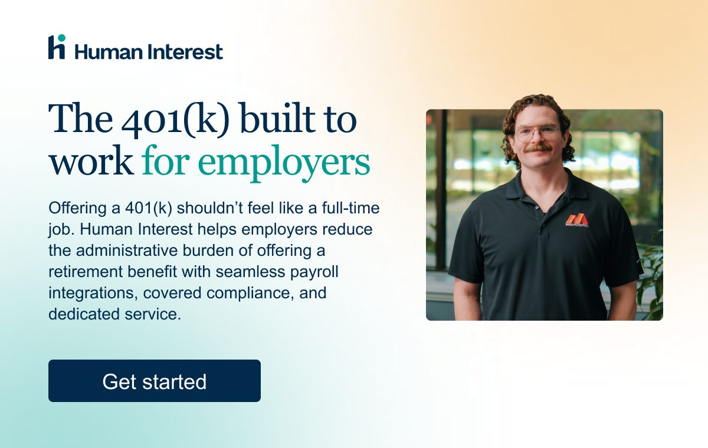

# Human Interest — Inc. eblast

Marketo-ready HTML for the Inc.com sponsored email. Design: [HI INC Email v1](https://www.figma.com/design/I0nWjOsxfWkDdrYxNl6UB1/SR---Human-Interest-Staging?node-id=3214-10738).

## Required assets

| Field | Value |
|---|---|
| **Subject** | Spending too much time on 401(k) admin? |
| **Preview** | It’s time to explore a plan designed and built to work better with your business. |
| **CTA** | [https://humaninterest.com/signup/fast-track/](https://humaninterest.com/signup/fast-track/) |
| **Preferred deployment time** | *TBD* |
| **Seed names** | *TBD* |

Submit the HTML at least **five business days** before the target send date.

## Specs (Inc.com)

- Package: eblast · File type: HTML
- Max width **600px** · max file size **200KB**
- Images hosted · links populated
- Coded for light and dark backgrounds
- **Do not** include opt-out / privacy language — Inc.com appends that from Inc.com before send
- HI legal (HIA adviser line) is in the footer

## Files

- `email.html` — 600px Marketo email. Live HTML for headline + body. Only **Get started** is the signup link. Guy photo is a hosted image, not a link.
- `index.html` — browser preview
- `images/logo.png` — Human Interest lockup
- `images/maxx-potential.jpg` — hero photo (right column)

## Preview

GitHub Pages (after first push):

- Preview: https://studiorendezvous.github.io/hi-inc-email/
- Email: https://studiorendezvous.github.io/hi-inc-email/email.html

Local: open `index.html`, or serve this folder (`python3 -m http.server 8082`).
